# Problema de Clasificación: Detección de Fatiga Muscular en Ciclismo

### Descripción del problema

Este proyecto aborda la detección de fatiga muscular en ciclismo en tiempo real, utilizando señales de electromiografía (EMG) registradas en 8 músculos de la pierna dominante. El dataset contiene 10 columnas y aproximadamente 3 millones de registros o filas.

El objetivo es construir un modelo de clasificación capaz de distinguir entre:

- **0 → Condición normal**
- **1 → Fatiga muscular**

Dataset: *Muscle Fatigue Cycling* (HuggingFace)

## 1. Análisis preliminar

### Preprocesamiento del target

Las etiquetas originales fueron transformadas a un problema binario:

- 0 → Condición normal  
- 1 → Fatiga muscular

En este punto se decidió, luego de ver las características del dataset (cantidad de filas y columnas), por convertir el dataset a un archivo CSV para no tener que solicitarlo a la página cada vez, sino simplemente leerlo desde la carpeta.

### Tipos de variables

- Variables numéricas continuas: señales EMG  
- Variable objetivo: categórica binaria  

---

## 2. Feature Engineering

### Ventaneo

Se aplicaron ventanas de **1 segundo (1000 muestras)** sobre las señales EMG.

### Características extraídas

Se generaron **56 características** (8 canales × 7 features):

#### Dominio del tiempo:
- RMS
- Varianza
- Cruces por cero
- Pendiente media

#### Dominio de la frecuencia:
- Frecuencia media
- Frecuencia mediana
- Potencia espectral

### Justificación

Estas características capturan:

- Intensidad muscular (RMS)
- Variabilidad (varianza)
- Activación neuromuscular (zero-crossing)
- Cambios espectrales asociados a fatiga

---

## 📊 3. Análisis Exploratorio de Datos (EDA)

### Señal en el tiempo

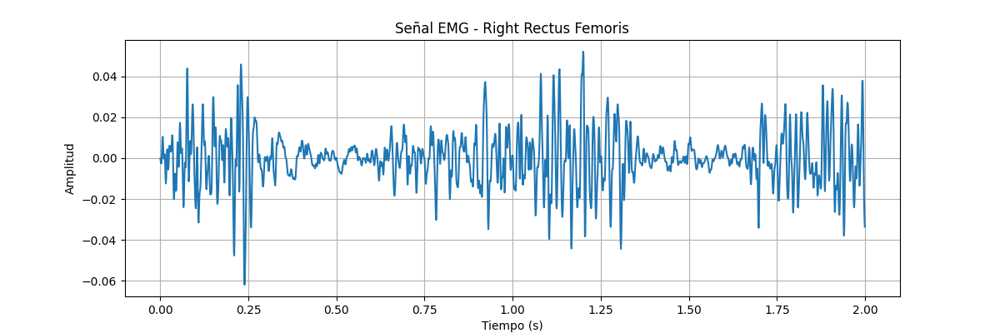

La señal EMG presenta un comportamiento no estacionario y altamente oscilatorio, típico de señales biológicas, con variaciones en la amplitud asociadas a cambios en la activación muscular.

### Distribución de características

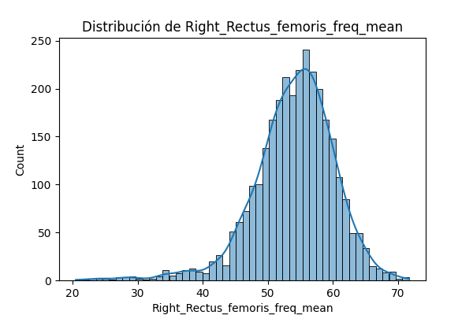
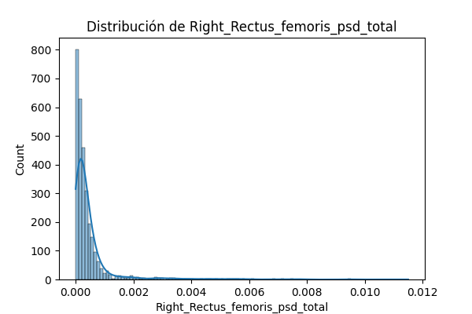
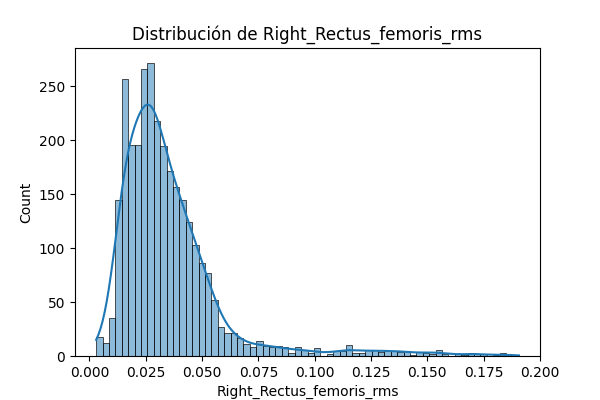
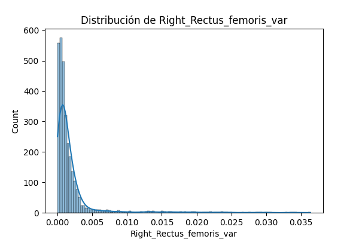

A excepción de la media, las variables presentan distribuciones no normales y sesgadas, indicando la presencia de variabilidad en la actividad muscular. Ciertamente los valores tienen tendencias fuertes hacia valores específicos pero igual existen otros valores lo que trae esa variabilidad

### Matriz de correlación

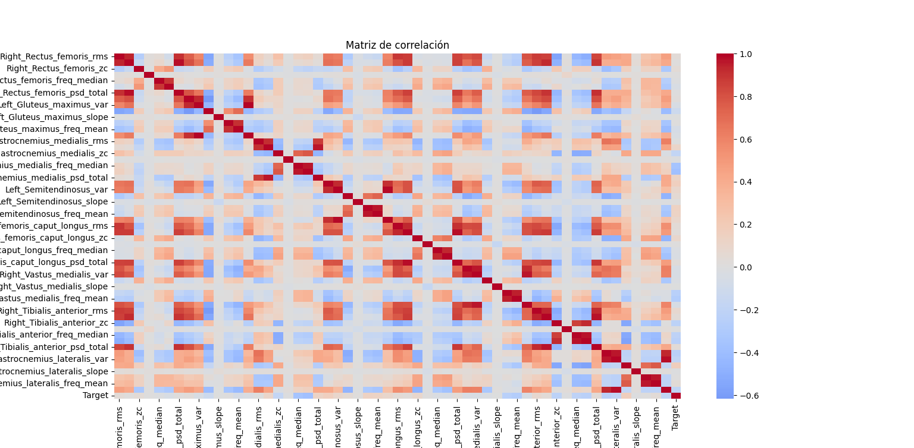

Se observan altas correlaciones entre las variables RMS, varianza y PSD, evidenciando redundancia. Por otro lado, no se observa una correlación fuerte entre una única característica y el target, lo que sugiere que la clasificación de fatiga muscular no depende de una sola variable, sino de la combinación de múltiples características. Esto refuerza la necesidad de utilizar modelos capaces de capturar relaciones multivariadas y no lineales.

### Relación con el target

#### RMS vs Target

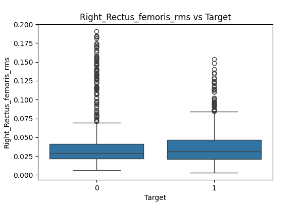

El RMS muestra diferencias entre clases, siendo mayor en fatiga, lo cual es consistente con la fisiología muscular.

#### Frecuencia media vs Target

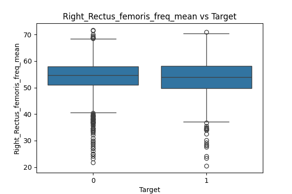

No presenta buena separabilidad, con alto solapamiento entre clases.

#### Potencia espectral vs Target

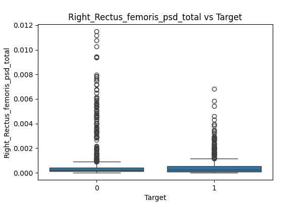

Se observa ligera diferencia, pero con alta dispersión y solapamiento.

### Balance de clases

- 71% → Normal  
- 29% → Fatiga

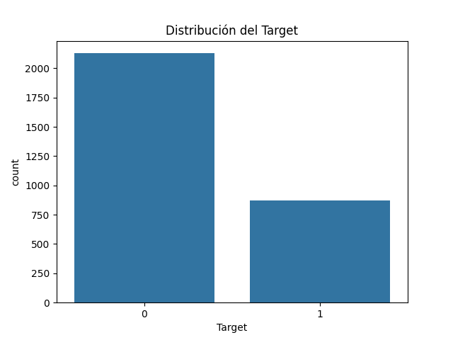

Dataset moderadamente desbalanceado.

### Conclusión EDA

El problema no es trivial, debido al solapamiento entre clases.  
Se requiere el uso de modelos capaces de capturar relaciones complejas.

---

## 4. Procesamiento de Datos

### División de datos

- Train: 70%  
- Validation: 15%  
- Test: 15%  

Se utilizó **estratificación** para preservar la distribución de clases.

### Normalización

Se aplicó **StandardScaler**, ajustado únicamente sobre el conjunto de entrenamiento para evitar *data leakage*.

### Pipeline

Se implementaron pipelines con scikit-learn para integrar preprocesamiento y modelado.

---

## 5. Modelos y comparación

### Modelos evaluados

- k-Nearest Neighbors (kNN)
- Decision Tree
- Random Forest
- Gradient Boosting
- Deep Neural Network (MLP)

### Ajuste de hiperparámetros

Se utilizó **GridSearchCV** con validación cruzada optimizando F1-score.

### Resultados

| Modelo | Dataset | Accuracy | Precision | Recall | F1 |
|--------|--------|---------|----------|--------|----|
| Random Forest | Test | 0.8869 | 0.8333 | 0.7633 | **0.7968** |
| Gradient Boosting | Test | 0.8625 | 0.8053 | 0.6946 | 0.7459 |
| DNN | Test | 0.8514 | 0.7711 | 0.6946 | 0.7309 |
| kNN | Test | 0.8492 | 0.7787 | 0.6717 | 0.7213 |
| Decision Tree | Test | 0.8314 | 0.7310 | 0.6641 | 0.6960 |

### Overfitting

Se observó overfitting en:

- Random Forest
- DNN

Detectado por diferencias entre train y test.

### Modelo seleccionado

**Random Forest**, por:

- Mejor F1-score
- Buen balance general
- Robustez ante ruido

---

## 6. Evaluación final

### Métricas

- Accuracy: 0.8847  
- Precision: 0.8376  
- Recall: 0.7481  
- F1-score: **0.7903**

### Matriz de confusión

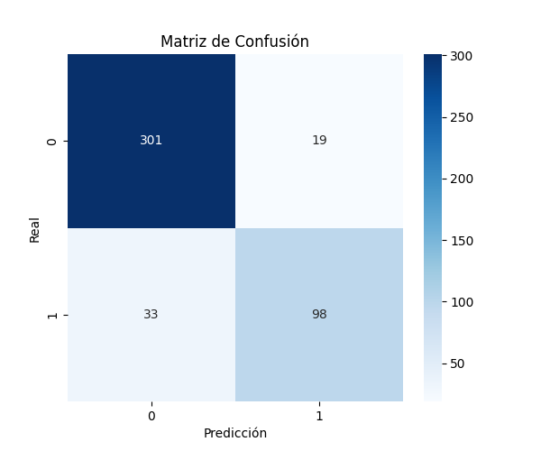

El modelo identifica correctamente la mayoría de casos, aunque presenta algunos falsos negativos en la clase de fatiga.

### Análisis por clase

- Clase 0 → excelente desempeño  
- Clase 1 → menor recall (fatiga no detectada en algunos casos)

### Conclusión

El modelo presenta buen desempeño general, aunque puede mejorarse en la detección de fatiga.

### Mejoras propuestas

- Balanceo de clases (SMOTE)
- Nuevas características
- Reducción de dimensionalidad
- Modelos más avanzados (CNN, LSTM)

---

## 7. Prueba con muestra artificial

### Resultado

- Clasificación: **Condición normal**
- Probabilidades: [0.85, 0.15]

### Interpretación

La muestra fue clasificada como normal debido a que fue generada a partir de valores promedio del dataset, dominados por la clase mayoritaria.

El modelo muestra consistencia y capacidad de generalización.

## Conclusión final

Se desarrolló un sistema completo de clasificación de fatiga muscular basado en señales EMG, logrando un modelo robusto mediante técnicas de ingeniería de características, análisis exploratorio y aprendizaje automático.

## Tecnologías usadas

- Python
- Pandas
- NumPy
- Scikit-learn
- Matplotlib / Seaborn

